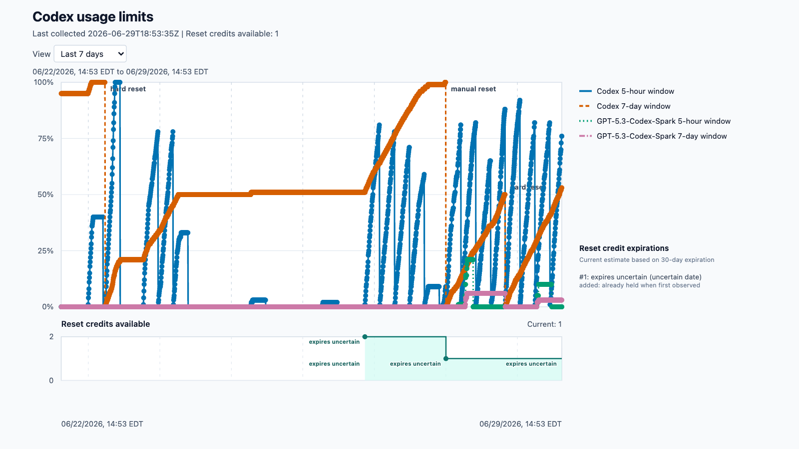

# Codex Meter

Codex Meter is a tiny macOS tool that records local Codex usage-limit snapshots
and renders them as a history graph.



The generated SVG is interactive: use the view dropdown to switch time windows,
and hover over plotted dots to see the model, window, collection time, and
percent used.

Codex already shows current usage. This tool keeps a local timeline so you can
see how each returned limit changes over time, including the 5-hour and 7-day
usage windows and their exact reset timestamps.

## What It Does

The collector starts the local Codex app-server, calls
`account/rateLimits/read`, and writes local files:

- `~/Documents/Archives/Codex Meter/snapshots.jsonl`
- `~/Documents/Archives/Codex Meter/latest.json`
- `~/Documents/Archives/Codex Meter/usage.svg`

When the app-server response includes reset credits, the collector also watches
`rateLimitResetCredits.availableCount`. If that count changes from the previous
snapshot, Codex Meter appends an event to
`~/Documents/Archives/Codex Meter/reset_credit_events.jsonl` and sends a macOS
notification.

The SVG graph defaults to the past 7 days and includes view options for common
time windows. When reset-credit data is available, the graph header shows the
current count and the lower strip shows the first count captured in local
history plus later count changes over the selected time range. The view
dropdown only changes what the graph displays; the sampling interval is set by
the LaunchAgent installer.

## Scope

- macOS only.
- Uses the local Codex app-server exposed by the Codex app and CLI.
- Tested on Codex.app `26.513.31313` and `codex-cli 0.130.0`.
- Tracks the response returned by `account/rateLimits/read`; it is not official
  OpenAI analytics or billing history.
- The local JSON files include plan type, usage percentages, credit state, and
  exact reset timestamps.
- Reset-credit alerts depend on the same app-server response. If Codex stops
  returning `rateLimitResetCredits.availableCount`, no alert is emitted.

## Disclaimer

This is an unofficial local utility. No warranty at all, not even that it works
as intended. It calls a local Codex app-server method that may change, move, or
disappear in future Codex releases. It records your own local usage-limit
snapshots, including the raw app-server rate-limit result with plan type, credit
state, limit IDs, window lengths, reset timestamps, and used percentages.

## Requirements

- Codex app installed and signed in.
- Codex CLI at `/opt/homebrew/bin/codex`.
- Homebrew Python at `/opt/homebrew/opt/python@3.13/bin/python3.13`.

## Run Once

```sh
python3 scripts/collect_codex_usage.py
```

The command writes or updates the files under
`~/Documents/Archives/Codex Meter/`.

When the reset-credit count changes, Codex Meter also writes
`~/Documents/Archives/Codex Meter/reset_credit_events.jsonl`.

## Open The Graph

```sh
open -a Safari "$HOME/Documents/Archives/Codex Meter/usage.svg"
```

Chrome works too:

```sh
open -a "Google Chrome" "$HOME/Documents/Archives/Codex Meter/usage.svg"
```

Hover directly over the plotted dots for the point details.

## Run On Startup

The installer writes and loads a LaunchAgent. With no arguments, it samples
every 5 minutes:

```sh
python3 scripts/install_launch_agent.py
```

To choose another sampling interval, pass a positive number and one unit:

```sh
python3 scripts/install_launch_agent.py 15 minutes
python3 scripts/install_launch_agent.py 1 hour
```

Supported units are `minutes`, `hours`, and `days`.

If you used the old `codex-usage-tracker` name, the installer migrates existing
snapshots from `~/Documents/Archives/Codex Usage Tracker/` into
`~/Documents/Archives/Codex Meter/` before loading the new LaunchAgent.
The historical archive directory is left in place after the new archive is
written.

To stop it:

```sh
launchctl bootout "gui/$UID" \
  "$HOME/Library/LaunchAgents/com.codex-usage-tracker.plist"
```

The LaunchAgent keeps the existing `com.codex-usage-tracker` service label so
macOS preserves background access to the local Documents archive. The project,
client name, and output archive use the Codex Meter name.

## Repository Contents

- `scripts/collect_codex_usage.py`: the collector and SVG renderer.
- `scripts/install_launch_agent.py`: the LaunchAgent installer.
- `scripts/migrate_to_codex_meter.py`: the old-name data migration.
- `docs/example-usage.png`: example graph shown in this README.
- `docs/research.md`: notes on the data source and related projects.

## License

MIT
