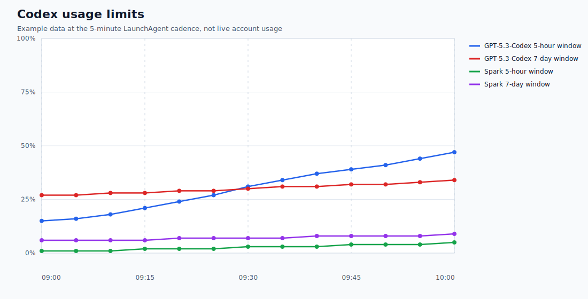

# Codex Usage Tracker

Codex Usage Tracker is a tiny macOS tool that records local Codex usage-limit
snapshots and renders them as a history graph.



Codex already shows current usage. This tool keeps a local timeline so you can
see how each returned limit changes over time, including the 5-hour and 7-day
usage windows and their exact reset timestamps.

## What It Does

The collector starts the local Codex app-server, calls
`account/rateLimits/read`, and writes three local files:

- `~/Documents/Archives/Codex Usage Tracker/snapshots.jsonl`
- `~/Documents/Archives/Codex Usage Tracker/latest.json`
- `~/Documents/Archives/Codex Usage Tracker/usage.svg`

The SVG graph plots usage percentage over time. Open it in a browser and hover
over the dots to see the model, window, collection time, and percent used.

## Scope

- macOS only.
- Uses the local Codex app-server exposed by the Codex app and CLI.
- Tested on Codex.app `26.513.31313` and `codex-cli 0.130.0`.
- Tracks the response returned by `account/rateLimits/read`; it is not official
  OpenAI analytics or billing history.
- The generated snapshots and latest-state JSON are local output. The
  checked-in `docs/example-usage.svg` is an intentional example graph.

## Requirements

- Codex app installed and signed in.
- Codex CLI at `/opt/homebrew/bin/codex`.
- Python 3.

## Run Once

```sh
python3 scripts/collect_codex_usage.py
```

The command writes or updates the files under
`~/Documents/Archives/Codex Usage Tracker/`.

## Open The Graph

```sh
open -a Safari "$HOME/Documents/Archives/Codex Usage Tracker/usage.svg"
```

Chrome works too:

```sh
open -a "Google Chrome" "$HOME/Documents/Archives/Codex Usage Tracker/usage.svg"
```

Hover directly over the plotted dots for the point details.

## Run On Startup

The included LaunchAgent runs the collector every 5 minutes:

```sh
launchd/com.mahos.codex-usage-tracker.plist
```

Install it from the repository root so the copied plist points at your local
clone:

```sh
PLIST="$HOME/Library/LaunchAgents/com.mahos.codex-usage-tracker.plist"

sed "s#__REPO_PATH__#$PWD#g" \
  launchd/com.mahos.codex-usage-tracker.plist > "$PLIST"

launchctl bootstrap "gui/$UID" \
  "$PLIST"

launchctl kickstart -k "gui/$UID/com.mahos.codex-usage-tracker"
```

To stop it:

```sh
launchctl bootout "gui/$UID" \
  "$HOME/Library/LaunchAgents/com.mahos.codex-usage-tracker.plist"
```

## Repository Contents

- `scripts/collect_codex_usage.py`: the collector and SVG renderer.
- `launchd/com.mahos.codex-usage-tracker.plist`: the 5-minute LaunchAgent.
- `docs/example-usage.svg`: real example graph output for the README.
- `docs/research.md`: notes on the data source and related projects.
